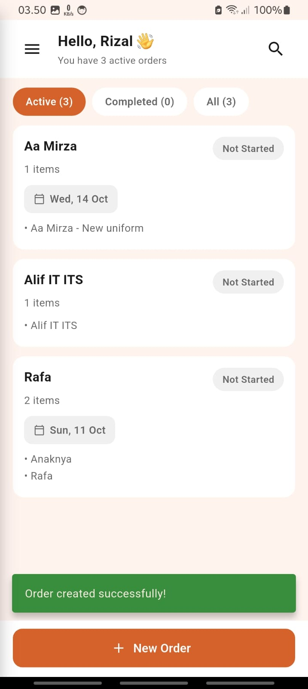
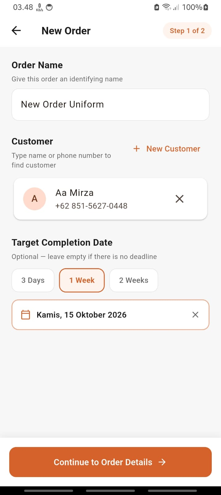
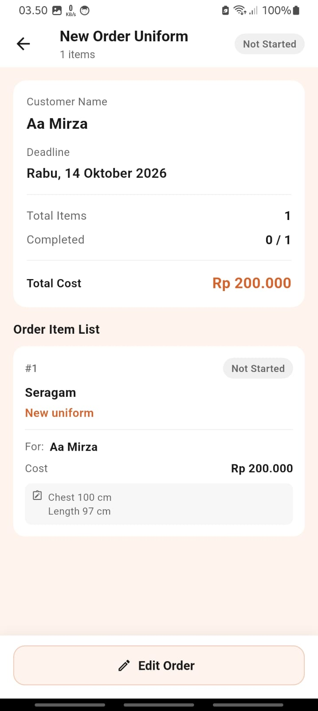
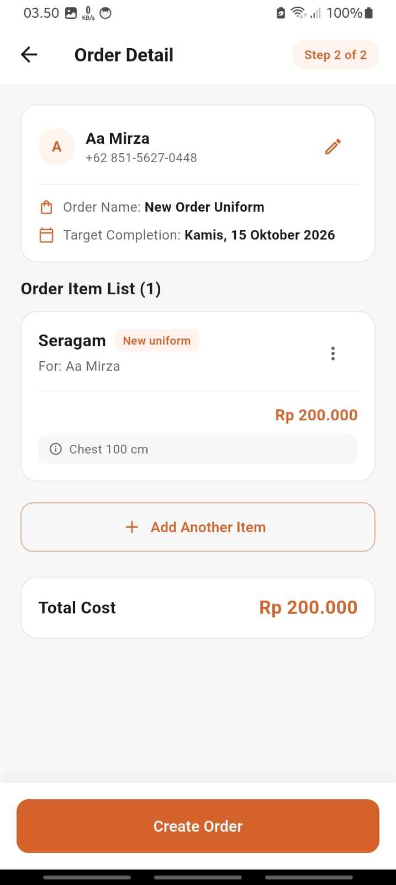

# Jahitin Mobile

[](https://flutter.dev)
[](https://dart.dev)
[](https://riverpod.dev)
[](https://m3.material.io)
[](./assets/translations)
[](https://github.com/mirza27/jahitin_be)

A Flutter mobile application designed to simplify order and customer record management for home-based tailors and sewing businesses.

In traditional home tailoring, orders and body measurements are frequently recorded on paper notes or scattered chat messages, leading to missed deadlines and forgotten customer details. Jahitin Mobile bridges this gap by providing an intuitive, lightweight mobile workspace built specifically for quick daily data entry without unnecessary complexity.

Backend repository: [github.com/mirza27/jahitin_be](https://github.com/mirza27/jahitin_be)

---

## App Previews

|                  Home Dashboard                   |                  Create Order (Step 1)                  |                  Order Details (Step 2)                  |                   Handle Order Item                    |
| :-----------------------------------------------: | :-----------------------------------------------------: | :------------------------------------------------------: | :----------------------------------------------------: |
|  |  |  |  |

---

## UI & UX Design Focus

A core focus during development was creating a clean and accessible user experience tailored to users who may not be accustomed to complex business software:

- **Streamlined 2-Step Order Flow**: Separates customer selection and deadline scheduling from item breakdown and cost details, keeping each screen focused and uncluttered.
- **Fast Contact Picker**: Direct integration with the phone's address book with instant search, eliminating repetitive manual typing for existing customers.
- **Clear Visual Feedback**: Interactive status chips, loading skeletons, explicit empty states, and dismissible bottom sheets designed for single-hand mobile use.
- **Frictionless Numeric Input**: Real-time thousands-separator currency formatting that handles price entry naturally while parsing clean numeric data under the hood.
- **Bilingual Accessibility**: Full runtime language switching between Indonesian and English with straightforward, domain-specific terminology.

---

## Key Features

- **Device Contact Integration**: Search and pick clients directly from device contacts (`flutter_contacts`) with debounced querying, or quickly register a new customer in-flow.
- **Modular Order Line Items**: Add multiple clothing items to a single order, select predefined or custom service types (Jahit Baru vs. Permak), and attach measurements and specific tailoring notes.
- **Target Deadline Controls**: Pick dates quickly via duration presets (3 days, 1 week, 2 weeks) or a custom calendar picker with timezone-aware ISO 8601 formatting.
- **Real-Time Cost Breakdown**: Automatic total price calculation across all order items with formatted currency summaries.
- **Order Lifecycle Tracking**: Filter orders by status (_Active_, _Completed_, _All_) with instant search and pull-to-refresh synchronization.
- **Encrypted Local Session**: Secure token and device credential management powered by `flutter_secure_storage`.

---

## Architecture

The application adopts a Feature-First folder organization with Riverpod managing application and widget state:

```text
UI (Screens & Modals)
         │
         ▼
Riverpod Notifiers & State
         │
         ▼
Feature Data / API Clients
         │
         ▼
Core Services (HTTP Client, Secure Storage)
         │
         ▼
Backend REST API / Encrypted Device Storage
```

### State Management & Implementation Notes

- **Riverpod 2.x**: State is managed through `NotifierProvider` and `AutoDisposeNotifierProvider` using immutable state classes with explicit lifecycle statuses (`initial`, `loading`, `ready`, `submitting`, `success`, `error`).
- **Scoped State Persistence**: Multi-step forms retain entered state across navigation transitions until explicitly completed or reset.
- **Permission Lifecycle**: Handles Android/iOS address book permissions with distinct states for granted, denied, and permanently denied access.

---

## Tech Stack

- **Framework & Language**: Flutter, Dart
- **State Management**: Riverpod (`flutter_riverpod`)
- **Networking**: `http`, `flutter_dotenv`
- **Local Persistence**: `flutter_secure_storage`
- **Device Integration**: `flutter_contacts`, `permission_handler`
- **Localization**: `flutter_localizations`, `intl`
- **Design System**: Material Design 3

---

## Project Structure

```text
lib/
├── core/
│   ├── constants/       # Color palette and secure storage keys
│   ├── data/            # Shared API clients (categories, services, orders)
│   ├── localization/    # Translation helpers and locale providers
│   ├── models/          # Shared domain models and request bodies
│   └── services/        # HTTP service and secure storage wrappers
├── features/
│   ├── auth/            # Authentication screens and session providers
│   ├── create_order/    # Two-step order creation and item bottom sheet
│   ├── detail_order/    # Order details, status changes, and item editor
│   ├── home/            # Dashboard, order lists, and search filters
│   ├── registration/    # Device-based user onboarding
│   └── splash/          # Startup routing and session verification
└── main.dart            # App entrypoint, localization delegates, and ProviderScope
```

---

## API Integration

The app communicates with the companion Go backend API:  
Backend Repository: [github.com/mirza27/jahitin_be](https://github.com/mirza27/jahitin_be)

### Key Endpoints

| Method | Endpoint               | Description                                    |
| :----- | :--------------------- | :--------------------------------------------- |
| `POST` | `/user/register/local` | Register device with tailor display name       |
| `POST` | `/auth/login/local`    | Authenticate registered device session         |
| `GET`  | `/auth/session`        | Validate bearer token and load user profile    |
| `POST` | `/order/create`        | Submit new order with nested order items       |
| `GET`  | `/order/list`          | Retrieve orders with status and search filters |
| `GET`  | `/order/detail/{id}`   | Fetch full order details and item list         |
| `PUT`  | `/order/update/{id}`   | Update existing order metadata                 |
| `GET`  | `/category/list`       | Fetch clothing categories                      |
| `GET`  | `/service/list`        | Fetch tailoring service types                  |

---

## Getting Started

### Prerequisites

- Flutter SDK (Dart 3.x)
- Android Studio / VS Code with Flutter extensions
- Android Emulator, iOS Simulator, or a connected physical device

### Setup

1. **Clone the repository:**

   ```bash
   git clone https://github.com/mirza27/jahitin_mobile.git
   cd jahitin_mobile
   ```

2. **Install dependencies:**

   ```bash
   flutter pub get
   ```

3. **Set up environment variables:**
   Create `.env` in the project root:

   ```dotenv
   API_URL=http://localhost:8001
   APP_DEBUG=false
   ```

4. **Run the app:**
   ```bash
   flutter run
   ```

---

## Scope & Future Improvements

This project serves as a practical mobile engineering showcase. Planned future explorations include:

- Offline-first caching using a local database (e.g., Hive or Isar).
- Unit and widget tests covering order calculations and form state transitions.
- Direct WhatsApp chat integration for notifying customers when orders are completed.
